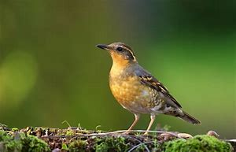

```{r setup, echo=FALSE, message=FALSE, warning=FALSE} 
knitr::opts_chunk$set(cache=TRUE)
knitr::opts_knit$set(root.dir = "C:/Users/ichintakayala/Documents/Data Cleaning") 
```

<div id="hd">
  
  
</div> 

# .R Packages required


Make sure you have latest R and Rstudio installed before starting this process. These are the R packages that are required to complete the data cleaning and documentation using Rstudio.

* knitr - for rendering HTML reports
* tidyverse - for data manupulations


**Note:** The above packages do not come with Rstudio installation, they need to be installed explictly, use the packages tab or just type install.packages("package_name").


Next load the R packages:
```{r message=FALSE}
library("knitr")
library("tidyverse")
```


# .Data sources


## Avian Monitoring Data

<div id="hd">
  
</div>
Image Source: www.hiveminer.com

We received data from Emily Kuzmick, the coastal program coordinator at Old Woman Creek National Estuarine Research Reserve. The data was posted in our college Canvas under our course file section. It was posted by our professor Dr. Andrea Wiggins under our course file section. We received zipped file where we had 10 other files in there. On those files we had Avian monitoring data in an excel spreadsheet. The spreadsheet contains over 50 columns including avian monitoring route, date, wind direction, temperature, etc. There are around 1435 rows containing data for these columns. Then there is Eagle Master spreadsheet which includes information regarding Bald Eagle Data. The spreadsheet has around 22 columns which contains information such as date when data is recorded, nest location of bald eagle, observer's location to nest, nest status, nest location wind, etc. There are also word documents which contains information related to bald eagle fact sheet, Avian activity monitoring sheet, Bald eagle monitoring sheet, phenological species monitoring at Old Woman Creek, a pdf document on identification of birds. 

Citizen scientists or volunteers collect the data at OWC. They come to the point and stand there 15 minutes for observation, and record everything they see and hear in that 15 minutes. Then, they are required to fill out the form which contains the critical attributes for the dataset.

Variable included:

*	Avian Monitoring Route
*	Date
*	Observer
*	Weather
*	 Temperature
*	Cloud Cover
*	Wind Velocity
*	Wind Direction
*	Precipitation
*	Vegetation Cover
*	Equipment
*	Start Time
*	End Time
*	Sound Distance
*	Time of Observation
*	Species Code
*	Heard/Seen
*	Number of Birds


```{r}

```


## Bald Eagle Activity Monitoring

<div id="hd">
  
</div> 
Image Source: Wikipedia

Staff, interns and volunteers collect the data at OWC. They collect data in two parts, firstly they collect weather conditions and secondly they make Eagle related observations. They stand at the observation points for minimum 30 minutes or more and make all these observations. They make their observations on a standard monitoring sheet, provided by OWC. They collect weather conditions along with Date, start time and end time of their observation such as Temperature, Cloud cover, Wind velocity, precipitation on the same sheet along with observer and the equipment used. 

Secondly, OWC collects Bald Eagle Activity data such as their Nest status(building, incubating, hatched), Nest conditions(good, poor, fair), Nest locations, Number of Birds in Nest, Approximate number of eggs, chicks if any. Additional comments are added to the sheet if any. OWC provided us with data from '4/2/1996' to '6/26/1999' and '3/7/2016' to '6/25/2018'. In short they gave two time periods data from 1996-99 and 2016-18.


Reading the CSV file with Bald Eagle data, there are 1678 rows and 21 columns.
```{r warning=FALSE}
raw_eagle_data <- read.csv("BaldEagle.csv", header = TRUE, na.strings = "")
dim(raw_eagle_data)
```


Total rows:
```{r}
nrow(raw_eagle_data)
```


Total Coloumns:
```{r}
ncol(raw_eagle_data)
```


# .Intellectual Policy


_Our team is using data that is intellectual property of Old Woman Creek, which is part of Ohio's State Department of Natural Resources. There is no license specified on their website, however the data we use is provided by OWC under agreement to use for Non-Commercial and Educational purpose only. Any party without any afflifiation with OWC needs to acquire license or consent from OWC to use this data. _


# .Metadata

## Avian Metadata


The metadata contains the information related to temperature, species, dates, eBird, etc which helps us to compare our data based on our research questions. Also the Bald Eagle data and the information such as nest location, number of birds present and plumages,etc. will help to work on our research question related to bald eagle nesting. 


## Bald Eagle Metadata


```{r}
colnames(raw_eagle_data)
```

| Field                     | Description                                        | Sample/Remarks                                 |
|---------------------------|----------------------------------------------------|------------------------------------------------|
| Date                      | Date of observation                                | 04/28/2018                                     |
| Nest.Location             | Location of nest in OWC                            | West Nest 1                                    |
| Observer.location.to.Nest | Observer standing location to Nest                 | West                                           |
| Nest.Status               | H-hatched, B-building, A-abandoned, I- Incubating  | H                                              |
| Nest.Condition            | Good/Fair/Poor                                     |                                                |
| Observer                  | name of the person who took the observation        |                                                |
| Temp                      | temperature in F                                   | 60                                             |
| Wind.Velocity.mph         | wind velocity in Mph                               | 13                                             |
| Wind.Direction            | direction of wind                                  | ESE                                            |
| Precipatation             | precipatation such as rain                         | Raining/0%                                     |
| Cloud.cover               | cloud cover in percentage                          | 5%                                             |
| Equipment                 | Equipment used by observer                         | Nikon   741-044                                |
| Start.Time                | start time                                         | 10:30                                          |
| End.Time                  | end time                                           | 12:30                                          |
| Time.of.observation       | time of observation                                | 10:45                                          |
| # Birds.Present.Plumages  | number of birds present including adult, juvenille | 1A, 2J                                         |
| # Birds.on.Nest           | number of birds present in nest                    | 1A                                             |
| Behavior.of.Adults        | what exactly adult is doing                        | adults eating                                  |
| Approx # of Eggs          | number of eggs approximation                       | 2                                              |
| Approx # of Chicks        | number of chicks approximation                     | 2                                              |
| Additional Comments       | If any comments observer adds them here            | Head up   very vigilant Calling out with voice |


# .Issues


## Bald Eagle Data issues

The Avian monitoring excel sheet has no values for column weather. So, we will remove this column

The Additional notes column has only four values from row 582 to 585.

There are misspelled names as "Trai" from row 933 to 940 and "Traiil" from row 1079 to 1087 in the column named monitoring route. So we will have to correct those. 

Dates are formatted incorrectly as there double forward slashes from row 567 to 573, rows 915 to 919, 923 to 925 in the column name Date

There are observer's name missing in the column observer in rows 920 to 922, rows 971 to 973, row 996, observer R Kovacs last name misspelled "Kovaks" in rows 1429 to 1435. 

There are missing wind data in column Wind in rows 31 to 38.

The direction column for wind has NE, ENE, SE, ESE, so replacing ENE with NE and ESE with SE. 

* Replacing ENE with NE in rows 21 to 30, 396 to 428, 689 to 703, 
*	SSW with SW in rows 39 to 54, 81 to 86, 131 to 156, 435 to 455, 653 to 659, 664 to 672, 728 to 738, 979 to 983, 1002 to 1010, 
*	WNW with NW in rows 55 to 66, 1176 to 1183, 1295 to 1313, 
*	WSW with SW in rows 75 to 80, 216 to 269, 606 to 611, 992 to 995, 1011 to 1018, 1133 to 1136, 
*	NNE with NE in rows 87 to 106, 304 to 316, 329 to 351, 360 to 367, 475 to 480, 641 to 647, 682 to 688, 747 to 762, 852 to 861, 881 to 887, 892 to 897, 1057 to 1067, 1088 to 1098, 1337 to 1341, 1397 to 1401, 
*	NNW with NW in rows 352 to 359, 673 to 681, 947 to 953, 
*	SSE with SE in rows 429 to 434, 527 to 553, 1393 to 1396,  
*	ESE with SE in rows 739 to 741, 964 to 970, 1426 to 1428
*	Missing data "N/A" in rows 927 to 932, 
*	SSw with SW in rows 974 to 978, 
*	Missing data "n/a" in rows 1035 to 1045,

Missing Values for column cloud cover from row 664 to 681, 912 to 919, 923 to 925, 992 to 995, 1011 to 1012, 1354 to 1364


## Bald Eagle Data issues

Data entry was handtyped into excel by the person. So there are few missing values and inconsistencies in data. But overall data quality is moderate. They followed propoer standard through the document.

There are many missing values such as: 

  + Observer's location to nest : No data until 2017
  + Nest condition : No data until 2017
  + Observer : few missing values randomly
  + Temp : few missing values randomly
  + Wind velocity: few missing values randomly
  + Wind-Direction: few missing values randomly
  + Precipitation: most of the values are missing
  + Cloud cover: few missing values randomly
  + Equipment: few missing values randomly
  + No Birds present & Plumages: less than 10 missing values
  + No Birds on Nest: less than 10 missing values
  + Behavior of Adults: mostly missing values
  + Approx. # of Eggs: 1307 NA values
  + Approx. # of Chicks: 464 NA values

Few values of Start time and End time are having time format as 1300, whereas most of the values are having 13:00 format. Multiple records exist for the same date. 


# .Remediating Data


## Avian Data Monitoring

paragraph1 for avian


## Bald Eagle Data

* Original dataset it provided in Excel sheet with multiple sheets inside, such as codes, and their initial analysis, so we separated the raw data into an CSV file. Just copy the data into new excel file and save as .csv
* The Title header was merged in the original excel, so we delete those merged cells.
* Missing values can be omitted easily, but without these values we cannot come to any conclusions and we are missing these values for the final analysis.
* Omit/remove the records which don't have data at all except the date.
* Temp, wind, etc are missing data since we are not using them, we will delete them columns.
* In place of # birds, # eggs, if the field is NA, replace with '0'.
* Important fields like Nest condition and Observers location to nest are blank before 2017, we leave them blank.


# .Data cleaning Steps 

## Avian Monitoring Data

1. There are misspelling and duplicate rows in Monitoring Route variables.
      Find misspelling words and replace with the correct words.
      Find the duplicate rows and remove it.
      
2. There are different format in Date variable
     Formulas: PROPER(TRIM(CLEAN()))
     Correct xx/xx//xxxx to xx/xx/xxxx
     
3. Define the measurement for Temperature variable.
       Insert Fahrenheit degree symbol.
       
4. There are ambiguous direction in Direction variable.
     Find ambiguous direction and replace with the clear direction.
     
5. Deleting the columns which are less critical for our data analysis such as Observer, Wind, Precipitation, Cloud Cover, Equipment, and Vegetation Cover


## Bald Eagle Activity Data

1. There are two rows with no nest location and other values missing values. 
```{r}
raw_eagle_data %>%
  filter(is.na(Nest.Location))
```

Omitting these values:

```{r}
clean_data <- raw_eagle_data[!is.na(raw_eagle_data$Nest.Location),]
```


2. Checking for NA value in Nest Condition. Similarly, do this for all the other attributes.
```{r}
nrow(is.na(clean_data$Nest.Condition))
```


3. Deleting the columns which are less significant for our data analysis such as Observer, Equipment, Wind direction.

```{r warning=FALSE}
clean_data <- subset(clean_data, select = -c(Observer,Equipment,Wind.Direction))
colnames(clean_data)
```

Note: In interest of time, we did following steps using excel, but not in Rstudio.

4. Fields with # birds, # eggs, # chicks we replaced NA with '0' int, since there is no data we assume count to be zero for easy analysis.

5. Nest condition and Observer's location to nest are blank before 2017. We leave them blank as of now. And use only data from 2016-2018 for data analysis.

6. If there are multiple records on same date, then merge them if the other values are same such as observer, time, # birds, etc. Take max if there is a conflict.

7. Blank comments are left unchanged.


# .Contributorship statement

### Indra Teja Chintakayala

As part of this assignment, I worked on cleaning and documenting the Bald Eagle data. I have also worked on preparing the Rmarkdown, colloborating the team's work, pushing the files to github and publishing the presentable document online. 


### Wancheng Sun


In this assignment, I worked on cleaning, documenting the Avian Monitoring data and collaborating the team's work.


### Kalapna Jha

In this assignment I worked on documentation part for the Avian Data monitoring. 
