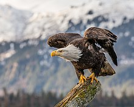

```{r setup, echo=FALSE, message=FALSE, warning=FALSE} 
knitr::opts_chunk$set(cache=TRUE)
knitr::opts_knit$set(root.dir = "C:/Users/ichintakayala/Documents/Data Cleaning") 
```

<div id="hd">
  
  
</div> 

# .R Packages required


Make sure you have latest R and Rstudio installed before starting this process. These are the R packages that are required to complete the data cleaning and documentation using Rstudio.

* knitr - for rendering HTML reports
* tidyverse - for data manupulations


**Note:** The above packages do not come with Rstudio installation, they need to be installed explictly, use the packages tab or just type install.packages("package_name").


Next load the R packages:
```{r message=FALSE}
library("knitr")
library("tidyverse")
```


# .Data sources


## Avian Monitoring Data

<div id="hd">
  
</div>
Image Source: www.hiveminer.com

Para1


Para2


```{r}

```


## Bald Eagle Activity Monitoring

<div id="hd">
  
</div> 
Image Source: Wikipedia

Staff, interns and volunteers collect the data at OWC. They collect data in two parts, firstly they collect weather conditions and secondly they make Eagle related observations. They stand at the observation points for minimum 30 minutes or more and make all these observations. They make their observations on a standard monitoring sheet, provided by OWC. They collect weather conditions along with Date, start time and end time of their observation such as Temperature, Cloud cover, Wind velocity, precipitation on the same sheet along with observer and the equipment used. 

Secondly, OWC collects Bald Eagle Activity data such as their Nest status(building, incubating, hatched), Nest conditions(good, poor, fair), Nest locations, Number of Birds in Nest, Approximate number of eggs, chicks if any. Additional comments are added to the sheet if any. OWC provided us with data from '4/2/1996' to '6/26/1999' and '3/7/2016' to '6/25/2018'. In short they gave two time periods data from 1996-99 and 2016-18.


Reading the CSV file with Bald Eagle data, there are 1678 rows and 21 columns.
```{r warning=FALSE}
raw_eagle_data <- read.csv("BaldEagle.csv", header = TRUE, na.strings = "")
dim(raw_eagle_data)
```


Total rows:
```{r}
nrow(raw_eagle_data)
```


Total Coloumns:
```{r}
ncol(raw_eagle_data)
```


# .Intellectual Policy


_Our team is using data that is intellectual property of Old Woman Creek, which is part of Ohio's State Department of Natural Resources. There is no license specified on their website, however the data we use is provided by OWC under agreement to use for Non-Commercial and Educational purpose only. Any party without any afflifiation with OWC needs to acquire license or consent from OWC to use this data. _


# .Metadata

## Avian Metadata


paragraph1 for avian


## Bald Eagle Metadata


```{r}
colnames(raw_eagle_data)
```

| Field                     | Description                                        | Sample/Remarks                                 |
|---------------------------|----------------------------------------------------|------------------------------------------------|
| Date                      | Date of observation                                | 04/28/2018                                     |
| Nest.Location             | Location of nest in OWC                            | West Nest 1                                    |
| Observer.location.to.Nest | Observer standing location to Nest                 | West                                           |
| Nest.Status               | H-hatched, B-building, A-abandoned, I- Incubating  | H                                              |
| Nest.Condition            | Good/Fair/Poor                                     |                                                |
| Observer                  | name of the person who took the observation        |                                                |
| Temp                      | temperature in F                                   | 60                                             |
| Wind.Velocity.mph         | wind velocity in Mph                               | 13                                             |
| Wind.Direction            | direction of wind                                  | ESE                                            |
| Precipatation             | precipatation such as rain                         | Raining/0%                                     |
| Cloud.cover               | cloud cover in percentage                          | 5%                                             |
| Equipment                 | Equipment used by observer                         | Nikon   741-044                                |
| Start.Time                | start time                                         | 10:30                                          |
| End.Time                  | end time                                           | 12:30                                          |
| Time.of.observation       | time of observation                                | 10:45                                          |
| # Birds.Present.Plumages  | number of birds present including adult, juvenille | 1A, 2J                                         |
| # Birds.on.Nest           | number of birds present in nest                    | 1A                                             |
| Behavior.of.Adults        | what exactly adult is doing                        | adults eating                                  |
| Approx # of Eggs          | number of eggs approximation                       | 2                                              |
| Approx # of Chicks        | number of chicks approximation                     | 2                                              |
| Additional Comments       | If any comments observer adds them here            | Head up   very vigilant Calling out with voice |


# .Issues


## Bald Eagle Data issues

paragraph1 for avian


## Bald Eagle Data issues


There are many missing values such as: 

  + Observer's location to nest : No data until 2017
  + Nest condition : No data until 2017
  + Observer : few missing values randomly
  + Temp : few missing values randomly
  + Wind velocity: few missing values randomly
  + Wind-Direction: few missing values randomly
  + Precipitation: most of the values are missing
  + Cloud cover: few missing values randomly
  + Equipment: few missing values randomly
  + No Birds present & Plumages: less than 10 missing values
  + No Birds on Nest: less than 10 missing values
  + Behavior of Adults: mostly missing values
  + Approx. # of Eggs: 1307 NA values
  + Approx. # of Chicks: 464 NA values

Few values of Start time and End time are having time format as 1300, whereas most of the values are having 13:00 format. Multiple records exist for the same date. 


# .Remediating Data


## Avian Data Monitoring

paragraph1 for avian


## Bald Eagle Data 

# .Steps 

## Avian Monitoring Data

1.

2. 


## Bald Eagle Activity Data

1. There are two rows with no nest location and other values missing values. 
```{r}
raw_eagle_data %>%
  filter(is.na(Nest.Location))
```

Omitting these values:

```{r}
clean_data <- raw_eagle_data[!is.na(raw_eagle_data$Nest.Location),]
```


2. Checking for NA value in Nest Condition
```{r}
nrow(is.na(clean_data$Nest.Condition))
```


3. Deleting the columns which are less significant for our data analysis such as Observer, Wind velocity, Precipatation, Cloud cover, Equipment, Wind direction.

```{r warning=FALSE}
clean_data <- subset(clean_data, select = -c(Observer,Wind.Velocity..mph.,Precipatation,Cloud.Cover,Equipment,Wind.Direction))
colnames(clean_data)
```


# .Contributorship statement

### Indra Teja Chintakayala

As part of this assignment, I worked on cleaning and documenting the Bald Eagle data. I have also worked on preparing the Rmarkdown, colloborating the team's work, pushing the files to github and publishing the presentable document online. 


### Wancheng Sun


### Kalapna Jha


